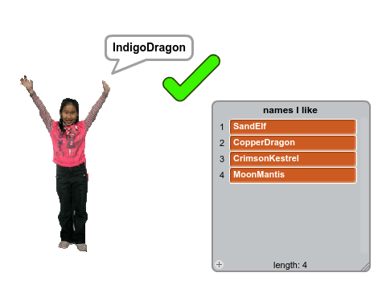

--- no-print ---

This is the **Scratch 2** version of the project. There is also a [Scratch 3 version of the project](https://projects.raspberrypi.org/cy-GB/projects/username-generator).

--- /no-print ---

## Cyflwyniad

It’s important not to use your real name or any personal information in your online username. In this project you’ll generate fun usernames that you can use on websites like Scratch.

Mae'n bwysig i beidio defnyddio dy enw go iawn neu unrhyw wybodaeth bersonol yn dy enw defnyddiwr arlein. Bydd y prosiect yma yn creu enwau defnyddiwr mae modd i ti eu defnyddio ar wefannau fel Scratch.

I brofi'r prosiect wedi cwblhau:

+ Clicia'r ferch i gynhyrchu enw defnyddiwr newydd;
+ Pan wyt ti'n dod o hyd i enw rwyt ti'n ei hoffi, clicia ar y tic i'w ychwanegu i'r rhestr;
+ Gwna clic-dde ar restr enwau defnyddiwr i arbed y rhestr o enwau i ffeil.

  <iframe allowtransparency="true" width="485" height="402" src="//scratch.mit.edu/projects/embed/213632065/?autostart=false" frameborder="0" allowfullscreen></iframe>
  

--- collapse ---
---
title: Nodiadau i Wirfoddolwyr
---

## Cyflwyniad:
Yn y prosiect yma bydd plant yn creu cynhyrchydd enwau defnyddiwr sydd yn awgrymu enwau sgrin mae modd defnyddio ar gyfer cyfrifon arlein. Byddant yn dysgu sut i allforio llun a ffeil testun o Scratch.  Mae'r prosiect yma yn rhan o Ddiwrnod Rhyngrwyd Saffach a'r pwysigrwydd o beidio rhannu gwybodaeth bersonol arlein.

## Adnoddau
Ar gyfer y prosiect yma, dylid defnyddio Scratch 2.  Mae modd defnyddio Scratch 2 arlein yma [jumpto.cc/scratch-on](http://jumpto.cc/scratch-on) neu mae modd ei lawrlwytho yma [jumpto.cc/scratch-off](http://jumpto.cc/scratch-off) a'i ddefnyddio heb gysylltiad gwe.

Mae'r ddolen 'Adnoddau Prosiect' ar gyfer y prosiect yma yn cynnwys yr adnoddau canlynol:

## Adnoddau Gwirfoddolwyr

Mae modd gweld y prosiect wedi ei gwblhau yma <a href="https://scratch.mit.edu/projects/213632065/">online</a>, neu mae modd ei lawrlwytho wrth glicio ar ddolen 'Adnoddau'r Prosiect' ar gyfer y prosiect yma, sydd yn cynnwys:

+ UsernameGenerator.sb2

## Adnoddau Prosiect

Ar gyfer y prosiect yma, mae modd i aelodau'r clwb ddefnyddio prosiect Scratch sydd yn cynnwys yr adnoddau angenrheidiol. Mae'r prosiect ar gael yma [jumpto.cc/username-go](https://scratch.mit.edu/projects/214080011/), neu mae modd ei lawrlwytho gan glicio'r 'Adnoddau Prosiect' sydd yn cynnwys:

+ UsernameGeneratorResources.sb2

Sicrhewch fod gan bob plentyn fynediad i gopi o'r adnoddau yma.

## Nodau Dysgu
+ Gweithio gyda rhestrau yn Scratch;
+ Defnyddio'r teclyn paentio i greu lluniau;
+ Allforio ffeiliau testun a lluniau o Scratch;
+ Pwyisgrwydd peidio rhannu gwybodaeth bersonol arlein. 

Mae'r prosiect yma yn trin elfennau sydd yn rhan o'r adran ganlynol o [Faes Llafur Gwneud Digidol Raspberry Pi](http://rpf.io/curriculum):

+ [Cyfuno adeiladwaith rhaglenni i ddatrys problem.](https://www.raspberrypi.org/curriculum/programming/builder)

## Heriau
+ "Ychwanegu mwy o amrywiaeth" - Ychwanegu mwy o amrywiaeth i'r enwau defnyddiwr gan ychwanegu eitemau i'r rhestrau;
+ "Ychwanegu rhif" - Ychwanegu rhif ar hap i ddiwedd yr enwau sy'n cael eu cynhyrchu;
+ "Creu llun proffil" - defnyddio'r teclyn paentio yn Scratch i greu llun proffil i gyd-fynd â'r enw defnyddiwr. 

--- /collapse ---
