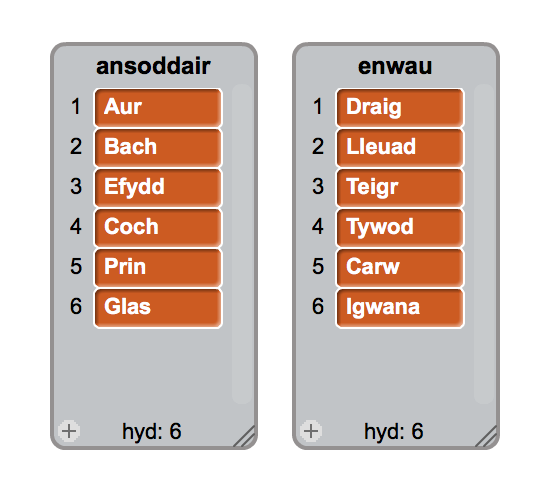
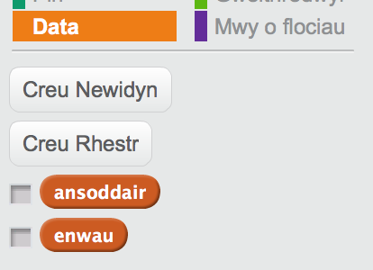
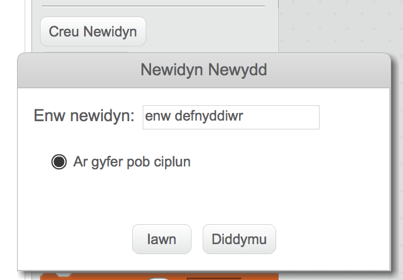
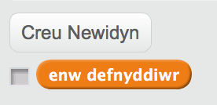
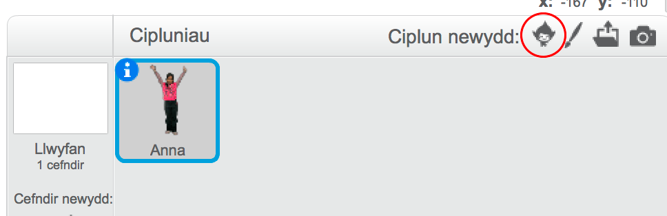
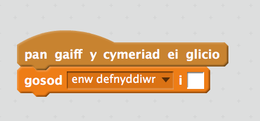
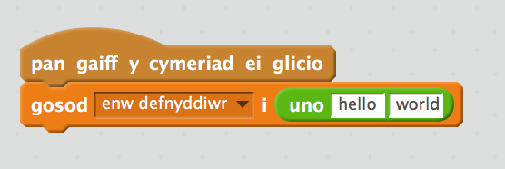
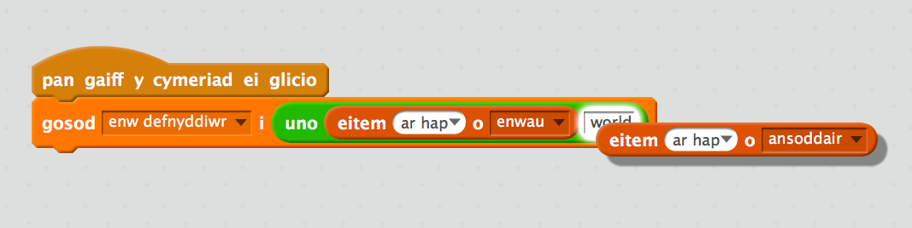
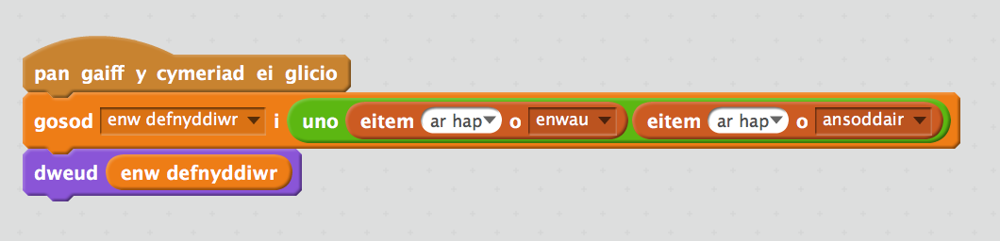
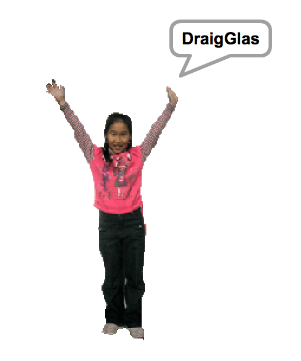

## Cynhyrchu Enwau Defnyddiwr

Mae llawer o wefannau ac apiau yn defnyddio enwau defnyddwyr i dy adnabod di. Mae'r enw defnyddiwr yma yn aml yn weledol i bobl eraill.

Mae'n bwysig nad yw dy enw defnyddiwr yn defnyddio dy enw go iawn nac yn cynnwys unrhyw wybodaeth bersonol fel oedran, blwyddyn geni neu lle wyt ti'n byw.  Bydd pobl eraill yn gweld dy enw defnyddiol felly gwna'n siwr ei fod yn gwrtais ac ystyria beth fydd pobl yn meddwl amdano ti pan maent yn ei ddarllen. Cofia y mae'n bosib y gwnei di ddefnyddio dy enw defnyddiwr am gyfnod hir, a fyddi di dal yn ei hoffi mewn tair mlynedd?

Fel rwyt ti'n gweld, mae'n bwysig dewis dy enw defnyddiwr yn ofalus.  Fe wnawn ni greu prosiect Scratch i gynhyrchu enwau defnyddiwr _EnwAnsoddair_ fel __IgwanaAur__.

+ Agora prosiect Scratch 'Cynhyrchu Enw Defnyddiwr'. Bydd arweinydd y clwb yn darparu copi o'r prosiect, neu mae modd ei agor arlein yma <a href="https://scratch.mit.edu/projects/214080011/" target="_blank">jumpto.cc/username-go</a>.

+ Fe ddylet weld dwy restr ar y llwyfan: `ansoddair` ac `enwau`:

	

+ Clicia Data a dad-glicia'r bocs drws nesaf i `ansoddair` ac `enwau` i'w cuddio.

	
	
+ Ychwanega newidyn `enw defnyddiwr`:

	
	
+ Dad-glicia'r bocs drws nesaf i'r newidyn enw defnyddiwr i'w guddio o'r llwyfan:

	

+ Ychwanega ciplun person, fe alli di ddewis pa un yr hoffet ti.  

	
	
	Fe alli di hefyd glicio Gwisgoedd a dewis y wisg. 

+ Ychwanega'r côd yma i giplun y person: 

	
	
+ Mae angen i ti gyfuno enw ac ansoddair. Ychwanegu bloc `uno`{:class="blockoperators"} tu fewn i dy floc gosod:

	
	
+ Ychwanega enw ar hap yn y blwch uno cyntaf: 

	
	
+ Ychwanega ansoddair ar hap yn yr ail flwch: 

	
	
+ Nawr ychwanega'r côd yma fel bod dy berson yn dweud yr enw defnyddiwr:

	

+ Profa dy gôd trwy glicio ar y person.  Fe ddylet gael enw ar hap bob tro.

	
