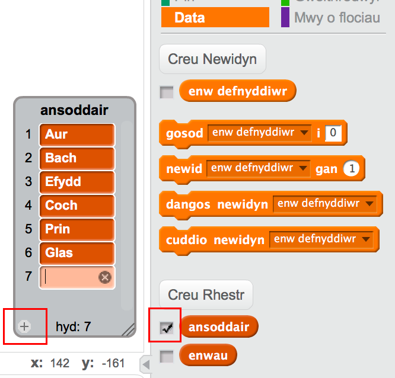

--- challenge ---
## Her: Ychwanegu mwy o amrywiaeth
Alli di ychwanegu mwy o eitemau i'r rhestr o ansoddeiriau ac enwau?

Dewisa'r rhestrau i'w dangos nhw ar y llwyfan.  Yna clicia __+__ i ychwanegu eitem newydd i'r rhestr. Paid anghofio cychwyn pob gair newydd gyda phrif lythyren.

Mae anifeiliaid a chreaduriaid go iawn a dychmygol yn gweithio'n dda ar gyfer enwau. Ceisia feddwl am rai anghyffredin.

Dyma rai syniadau ar gyfer ansoddeiriau:

+ Metalau: Sinc, Copor, Haearn, Efydd, Arian, Aur
+ Lliwiau: Rhuddgoch, Glaswyrdd, Euraidd, Indigo
+ Perlau: Emrald, Saffir, Deimwnt
+ Cynefinoedd: Lleuad, Anialwch, Eira, Jwngwl, Coedwig, Gofod

Cofia guddio dy restrau o'r llwyfan pan wyt ti'n profi'r prosiect.

--- /challenge ---
