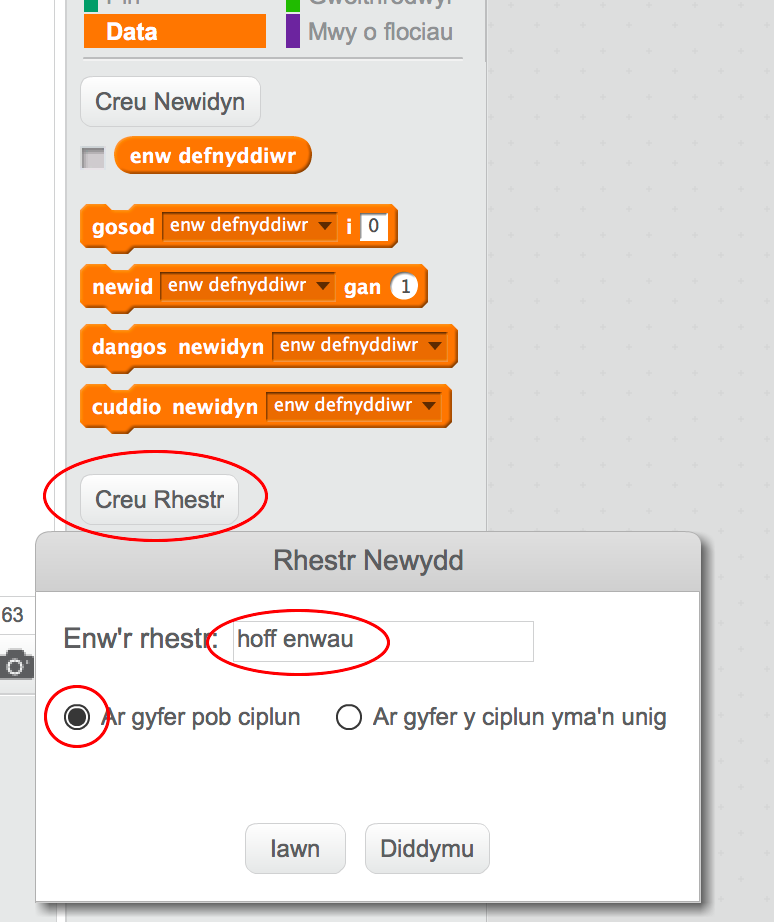
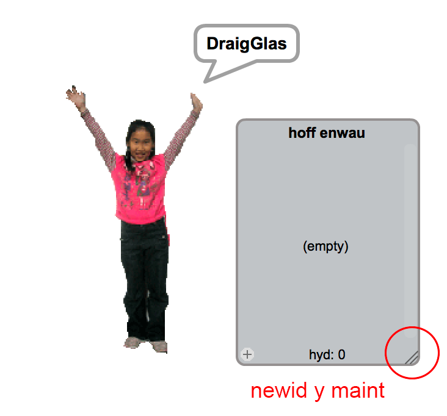
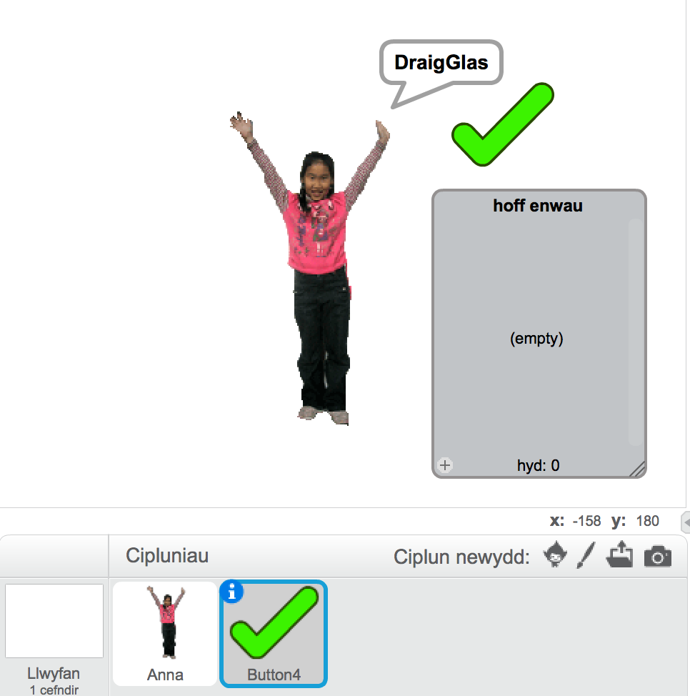
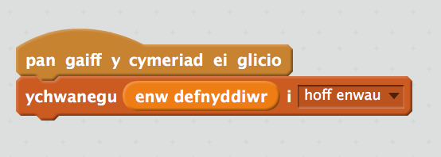
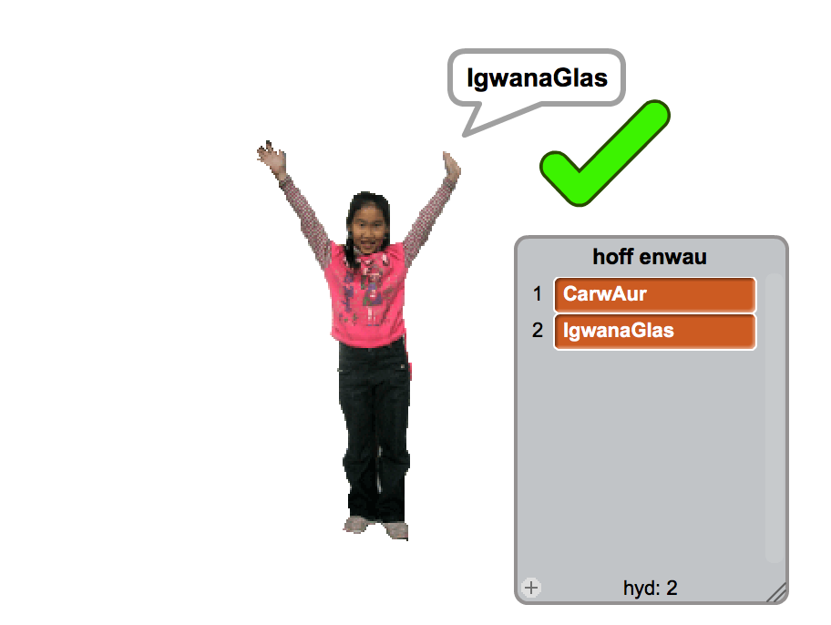
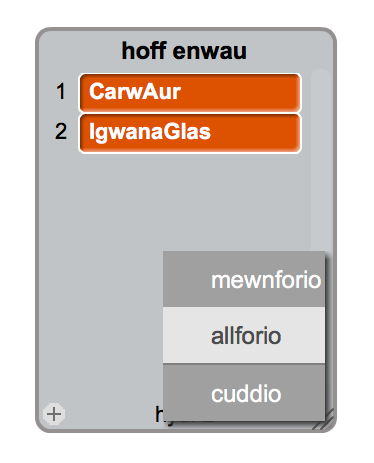

## Arbed dy hoff Enw Defnyddiwr

Rwyt ti siwr o fod eisiau ystyried enwau defnyddiwr gwahanol. Fe awn ati i ychwanegu enwau defnyddiwr rwyt ti'n eu hoffi i restr.

+ Bydd angen creu rhestr newydd o'r enw 'Hoff enwau':

	

+ Bydd y rhestr yn ymddangos ar y llwyfan. Llusga'r rhestr i'r dde o dy berson i'w wneud yn fwy llydan:

	

+ Ychwanega ciplun tic a'i lusgo ar y llwyfan i'r dde o'r person:

	

+ Ychwanega gôd i giplun y tic i ychwanegu'r enw defnyddiwr cyfredol i 'hoff enwau' pan yn clicio'r tic:

	

+ Profa dy gôd trwy glicio ar y person tan dy fod yn dod o hyd i enw defnyddiwr rwyt ti'n ei hoffi ac yna clicio'r tic:

	

+ Mae modd i ti allforio dy restr o enwau posib i ffeil testun. Gwna clic-dde ar y rhestr 'hoff enwau' ar y Llwyfan a dewis 'Allforio' a dewis lle i'w arbed (gofyna i arweinydd dy glwb os nad wyt ti'n siwr lle i'w arbed.)

	
	
	Mae gen ti nawr ffeil testun yn cynnwys rhestr o enwau mae modd i ti ei agor gyda Notepad neu olygydd testun arall. 
