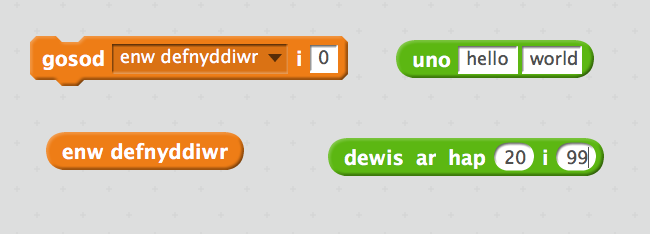
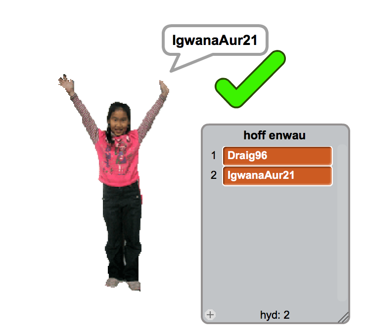

--- challenge ---
## Her: Ychwanegu rhif

Ar rhai gwefannau ac apiau poblogaidd mae'n gallu bod yn anodd i ddod o hyd i enw defnyddiwr nad yw'n cael ei ddefnyddio'n barod. Mae'n bosib y byddi di'n darganfod bod dy enw defnyddiwr yn cael ei ddefnyddio'n barod. Fe alli di ychwanegu rhif i ddiwedd yr enw. Cofia beidio defnyddio dy oedran, dyddiad dy benblwydd neu dy flwyddyn geni.

Wyt ti'n gallu defnyddio'r blociau yma i gynhyrchu enwau defnyddiwr gyda rhif ar hap ar eu diwedd?

Fe ddylai dy enw defnyddiwr gael rhif ar y diwedd:

--- /challenge ---
