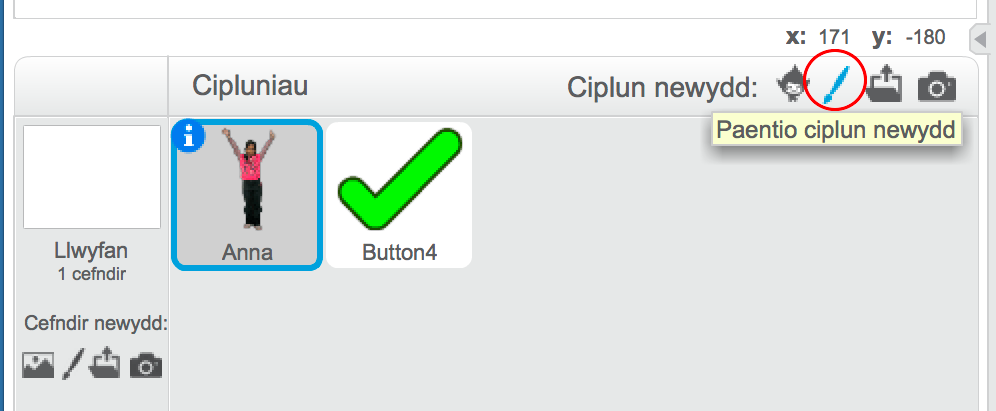
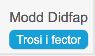
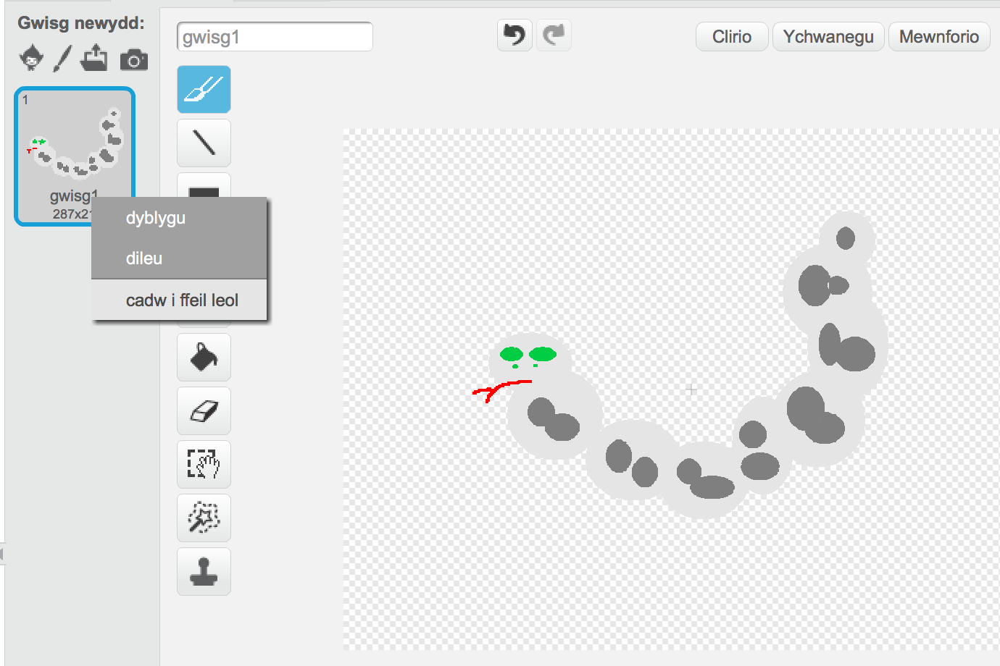

--- challenge ---
## Her: Creu dy lun proffil 

Wyt ti'n gallu defnyddio'r teclyn paentio ciplun yn Scratch i greu dy lun proffil i gyd-fynd gyda dy enw defnyddiwr?

Os wyt ti eisiau ceisio tynnu llun yn defnyddio siapau mae modd symud o gwmpas, yna trosa i fector trwy glicio'r botwm ar waelod dde y sgrin:

Dyma enghraifft:

Fe alli di hefyd arbed dy lun fel dy fod yn gallu ei ddefnyddio ar wefannau ac apiau yn lle llun proffil. Gwna clic-dde ar y wisg i'w arbed i ffeil lleol:

Bydd lluniau wedi cael eu creu mewn modd didfap yn arbed fel ffeiliau '.png'. Bydd lluniau fector yn arbed fel ffeiliau 'svg'.

Mae ffeiliau '.png' yn cael eu defnyddio yn fwy aml, mae modd newid i fodd didfap i gael ffeil '.png' (bydd dad-wneud yn mynd a ti nol i fodd fector).

--- /challenge ---
