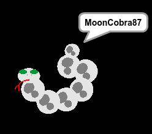
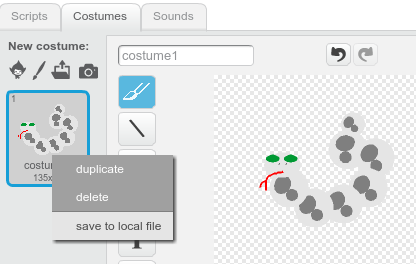

--- challenge ---
## Challenge: create your profile picture

Can you use the paint tool in Scratch to create your own profile picture to go with a username?

Here's an example:

To save your picture so that you can use it on websites or apps which show profile pictures, right-click on a costume to save it as a file on your computer.

Images created in **bitmap mode** will be saved as the widely used `.png` files. If you've been drawing in vector mode and want to save your picture as a `.png` file, switch to bitmap mode before saving. Clicking **undo** will get you back to vector mode.

--- /challenge ---
